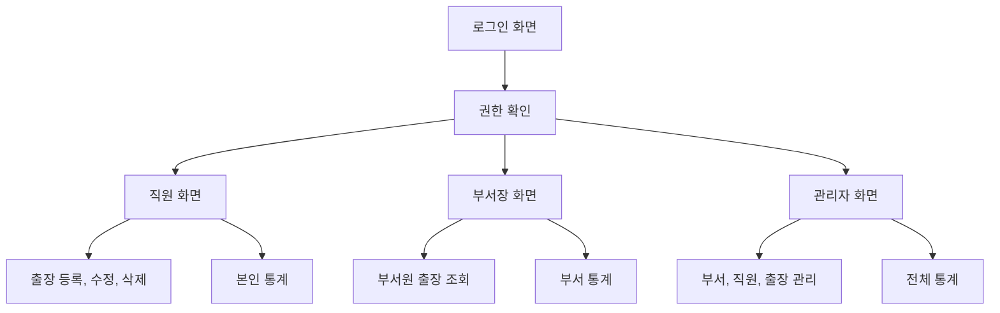

# 출장 관리 앱 구현 계획

이 문서는 **Git과 함께 옮겨가는 계획의 정본**입니다. Cursor IDE의 `.cursor/plans` 안에 있던 계획을 이 경로로 옮겨 두었으며, 이후 계획 수정은 우선 이 파일을 기준으로 합니다.

**요약:** GitHub Pages 정적 프론트엔드와 Supabase(무료 플랜) PostgreSQL을 결합해 직원 출장 등록, 권한별 조회, 관리자 관리, 통계를 구현합니다. 로그인은 Supabase 기본 로그인으로 단순화하고, 관리자 비밀번호 초기화는 우선 Supabase 콘솔로 처리하는 운영 경로를 둡니다.

## 진행 체크리스트

- [ ] **foundation-db-app**: 정적 앱 뼈대 + Supabase(무료) 연결 + 테이블 스키마(부서·직원·출장·국가 등) 확정
- [ ] **auth-rls**: Supabase 로그인 + 직원행 연동 + RLS(직원·부서장·관리자) 정책
- [ ] **product-ship**: 출장 CRUD·현재 출장자·통계·관리자 화면 + GitHub Pages 배포·바로가기

---

## 전제와 방향

현재 저장소는 [PROJECT_CONTEXT.md](../PROJECT_CONTEXT.md), [README.md](../README.md), [TODO.md](../TODO.md) 같은 문서만 있고 실제 앱 파일은 아직 없습니다. 따라서 구현은 새 정적 웹앱을 만드는 방식으로 시작합니다.

선택 방향은 다음과 같습니다.

- 프론트엔드: GitHub Pages에 배포 가능한 정적 웹앱
- 데이터베이스: **Supabase 무료 플랜**의 PostgreSQL
- 로그인: **Supabase가 제공하는 기본 로그인**(화면에서는 부서·ID·비밀번호만 입력하는 UX 유지). 비밀번호는 앱이 직접 테이블에 넣지 않고 Supabase Auth가 안전하게 처리
- 권한·데이터 보호: **RLS**로 직원·부서장·관리자 구분
- 관리자 비밀번호 초기화: **가장 단순한 1단계**는 Supabase 대시보드에서 해당 사용자 비밀번호만 재설정(앱에 비밀 서버 코드 없이 가능). 나중에 필요하면 관리 화면 버튼·Edge Function을 **추가 옵션**으로 붙임
- 배포 결과: `index.html`을 첫 페이지로 두고, 배포 후 `ShortCut` 폴더에 `.url` 바로가기 생성

이 구조는 [PROJECT_CONTEXT.md](../PROJECT_CONTEXT.md)의 GitHub Pages 운영 규칙을 유지하면서, 여러 직원·관리자가 같은 출장 데이터를 공유해야 하는 요구사항을 충족하기 위한 것입니다.

## 로그인 설계 (단순 버전)

복잡한 «자격 증명 패턴」 비교 없이, 아래 한 줄로 정리합니다.

**직원 한 명 = Supabase 로그인 계정 1개 + `employees` 행 1개**만 맞춰 두면 됩니다.

- 화면: **부서 → ID → 비밀번호**만 보여 줍니다. ID는 `yh.seo` 같은 형태이며 대소문자를 구분하지 않습니다.
- 내부: 직원 ID를 소문자로 정규화하고 `직원ID@project.local` 형태의 Supabase Auth 이메일로 `signInWithPassword` 를 호출합니다.
- 비밀번호 저장·검증은 **전부 Supabase Auth**가 처리합니다. 앱이 직접 DB에 비밀번호를 넣거나 해시를 비교할 필요가 없습니다.

**처음부터 로그인 가능하게 만드는 방법(운영을 단순하게)**

1. 관리자 화면에서 부서, ID, 이름, 초기 비밀번호 입력
2. 앱이 Supabase Auth 사용자를 만들고, `employees` 행의 `login_id`, `login_email`, `auth_user_id` 를 자동 연결

직원이 많지 않으면 처음에는 이 방식만으로도 충분합니다. 나중에 관리 화면에서 «직원 추가」를 자동화하고 싶을 때만 Edge Function이나 SQL 스크립트를 더하면 됩니다.

**관리자가 비밀번호를 쉽게 초기화하는 방법**

- **가장 단순(추천 1단계)**: Supabase 대시보드 → 해당 사용자 → 비밀번호 재설정. 앱 코드 추가 없음.
- **나중에 필요 시**: 관리자 전용 화면에 «비밀번호 초기화」 버튼을 두고 Edge Function이 처리(이때만 service role 사용).

이렇게 하면 이전 계획에 있던 패턴 A·B 설명과 별도 용어 없이, 운영과 구현이 같이 단순해집니다.

## 핵심 화면 구조

앱은 크게 로그인 화면, 직원 화면, 부서장 화면, 관리자 화면으로 나눕니다.

로그인 화면은 문서 요구대로 `부서명 드롭다운 → 이름 드롭다운 → 비밀번호 입력` 흐름으로 구현합니다. 내부적으로는 선택한 직원에 연결된 **로그인용 고유 문자열**로 Supabase 로그인만 호출합니다.

## 데이터 모델 (PostgreSQL / Supabase)

테이블 예시는 다음과 같습니다.

- `departments`: 부서 정보
  - `id`, `name`, `is_active`, `created_at`, `updated_at`
- `employees`: 직원 정보
  - `id`, `department_id`, `name`, `role` (`employee` | `department_manager` | `admin`)
  - `login_id`: 화면에서 입력하는 직원 ID(예: `yh.seo`, 소문자 정규화)
  - `login_email`: Supabase Auth에 등록한 내부 이메일(예: `yh.seo@project.local`)
  - `auth_user_id`: `auth.users` 와 1:1로 연결(선택적으로 자동 동기화 가능하지만, 계획상 수동 연결로도 충분)
  - `is_active`, `must_change_password`, `created_at`, `updated_at`
- `trips`: 출장 정보
  - `id`, `employee_id`, `department_id`
  - `start_date`, `end_date`, `country`, `company_name`, `city`, `note`
  - `status` (`active` | `cancelled` | `deleted`)
  - `created_at`, `updated_at`
- `countries`: 국가 드롭다운
  - `id`, `name`, `sort_order`, `is_active`
- `audit_logs`: 관리자 수정·비밀번호 초기화 등
  - `id`, `actor_employee_id`, `action`, `target_type`, `target_id`, `created_at`

FK와 인덱스: `trips(employee_id, department_id)`, 자주 쓰는 조회·통계용 `(start_date, end_date)`, `employees(department_id)` 등.

## 권한 규칙

요구사항의 권한 범위는 다음처럼 구현합니다.

- 일반 직원
  - 본인 출장만 등록, 수정, 취소 가능
  - 본인 출장 통계만 조회
  - 같은 부서의 현재 출장자·출장 통계 조회는 [PROJECT_CONTEXT.md](../PROJECT_CONTEXT.md) 23행 요구를 반영하되, 상세 개인정보 노출 범위는 제한
- 부서장
  - 본인 부서 직원의 출장 현황 조회
  - 본인 부서 통계 조회
  - 직원 데이터는 조회 중심, 잘못된 입력 수정은 관리자 권한과 분리
- 관리자
  - 부서 추가·수정·비활성화
  - 직원 등록, 부서 배정, 권한 지정, 비밀번호 초기화
  - 전체 출장 현황 조회 및 직원이 잘못 입력한 출장 정보 수정

보안은 UI 숨김만으로 두지 않고 **Row Level Security(RLS)** 로 테이블·행 단위 접근을 제한합니다. 직원은 `auth.uid()`와 연결된 `employees` 행을 기준으로 본인·부서 범위만 읽고 쓰도록 정책을 나눕니다.

## 비밀번호 처리

- 최초·초기화 비밀번호는 관리자가 Supabase 콘솔에서 설정하거나, 나중에 관리 화면에서 설정
- 직원 변경: 현재 비밀번호·새 비밀번호·확인 일치, 최소 길이, 기존과 동일 금지 ([PROJECT_CONTEXT.md](../PROJECT_CONTEXT.md) 조건)
- 직원 본인 변경: Supabase Auth의 비밀번호 변경 API 사용, 성공 시 `must_change_password` 해제
- 관리자 초기화: **1단계**는 Supabase 콘솔에서 즉시 변경. 앱에서도 남기고 싶으면 `audit_logs` 에만 기록하거나, 추후 Edge Function 도입 시 함께 기록

## 출장 등록과 조회 흐름

출장 등록 폼은 문서의 필수·선택 항목을 그대로 반영합니다.

- 필수: 출장 시작일, 출장 종료일, 국가, 방문업체명
- 선택: 도시명, 비고
- 검증: 종료일이 시작일보다 이르면 저장 불가
- 삭제: 물리 삭제보다 `status` 를 `cancelled` 또는 `deleted` 로 두는 쪽을 우선

현재 출장자는 오늘 날짜가 `start_date <= 오늘 <= end_date` 이고 `status` 가 유효한 행을 조회·표시합니다.

## 통계 산정 방식

- Supabase에서 `trips` 를 조회한 뒤 프론트에서 집계하거나, **SQL 뷰·RPC** 로 연도별·부서별·직원별·국가별 출장일수를 계산합니다.
- 데이터가 커지면 집계 테이블·배치는 후속 단계로 분리합니다.

출장일수는 시작일·종료일 **양 끝 포함**으로 계산합니다.

## 파일 구성 제안

초기 구현은 유지보수가 쉬운 정적 구조로 시작합니다. (프로젝트 루트 기준)

- [index.html](../index.html): 앱 진입점
- [src/main.js](../src/main.js): 초기화와 라우팅
- [src/supabase.js](../src/supabase.js): Supabase 클라이언트 생성(anon key만 사용)
- [src/auth.js](../src/auth.js): 로그인, 로그아웃, 비밀번호 변경
- [src/store.js](../src/store.js): 테이블별 조회·저장 래퍼
- [src/permissions.js](../src/permissions.js): 역할별 화면·쿼리 제한
- [src/trips.js](../src/trips.js): 출장 CRUD, 현재 출장자 계산
- [src/stats.js](../src/stats.js): 통계 계산 또는 RPC 호출
- [src/admin.js](../src/admin.js): 부서·직원·전체 출장 관리
- [src/styles.css](../src/styles.css): 공통 스타일
- [supabase/migrations/](../supabase/migrations/): 스키마·RLS·RPC 정의
- [supabase/functions/](../supabase/functions/): (선택) 직원 자동 생성·앱에서 비밀번호 초기화가 필요해질 때만 추가

## 구현 순서

1. 정적 앱 뼈대와 Supabase 프로젝트(무료 플랜) 연결, 스키마 마이그레이션 초안
2. Supabase Auth 사용자 1명 + `employees` 1행으로 수동 연결해 로그인·RLS 기준을 먼저 검증
3. 부서·직원 데이터를 읽어 로그인 드롭다운 구성
4. 직원 출장 등록·수정·취소
5. 권한별 출장 조회 화면
6. 현재 출장자 표시와 통계
7. 관리자 부서·직원·출장 관리(필요 시에만 Edge Functions)
8. RLS 전면 적용·권한별 접근 테스트
9. GitHub Pages 배포 후 `ShortCut` 바로가기 생성 및 접속 확인

## 주의할 점

- Supabase **anon key** 는 클라이언트에 있어도 되지만 **service role key** 는 브라우저에 넣지 않고, Edge Function 등 서버 측에만 둡니다(콘솔로 비밀번호만 관리하면 처음에는 service role 없이도 진행 가능).
- `.env` 등에 들어가는 비밀은 저장소에 커밋하지 않습니다.
- 직원 이름만으로는 중복 가능성이 있으므로 내부 식별은 `employee_id` 와 로그인용 문자열로 통일합니다.
- 부서·직원 삭제는 가능하면 `is_active = false` 비활성화를 우선합니다.
- 비밀번호 평문은 DB 컬럼에 저장하지 않습니다. Supabase Auth가 담당합니다.
